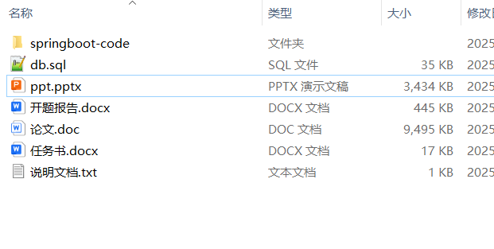
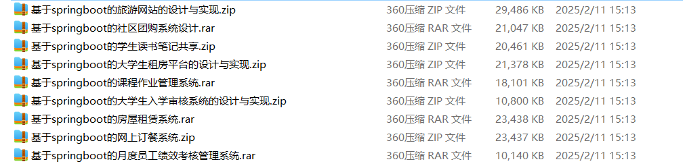

# springboot_yoga_studio_employee_health_online_decoration

📦 SpringBoot多功能项目仓库 🎯

本仓库汇集了三个基于 **Spring Boot** 开发的高实用性项目，涵盖**瑜伽馆管理**、**员工健康管理**、**在线装修管理**等多个领域，适用于**健身机构**、**企业健康管理部门**、**家装公司**，助力提升**会员管理**、**员工健康监测**、**装修项目管理**的效率，为行业提供智能化解决方案！🚀

🧘‍♀️ **瑜伽馆管理系统** —— 提供**会员管理**、**课程预约**、**教练排班**、**课时统计**等功能，优化**瑜伽馆运营**，提升**会员体验**，适用于**瑜伽馆**、**健身中心** 🏋️‍♀️📅

💼 **员工健康管理系统** —— 具备**健康档案记录**、**健康评估**、**体检预约**、**健康报告分析**等功能，助力企业**关注员工健康**，提升**企业健康管理**智能化水平，适用于**企业人力资源**、**健康管理中心** 📊🩺

🏠 **在线装修管理系统** —— 提供**装修需求提交**、**项目进度跟踪**、**施工方案管理**、**装修预算控制**等功能，优化**装修流程管理**，提升**装修公司运营效率**，适用于**装修公司**、**家装平台** 🏡🛠️

**项目部署说明**✨：

推荐使用：**谷歌浏览器**

**后台地址**😎

http://localhost:8080/springboot/admin/dist/index.html

**前台地址**😎

http://localhost:8080/springboot/front/index.html

在**src\main\resources\application.yml中**编辑数据库配置🎉										
url:jdbc:mysql://127.0.0.1:3306/springbootuseUnicode=true&characterEncoding=utf8&useJDBCCompliantTimezoneShift=true&useLegacyDatetimeCode=false&serverTimezone=UTC
username: root
password: 123456

**文档预览**👀

**其他项目合集**✨

